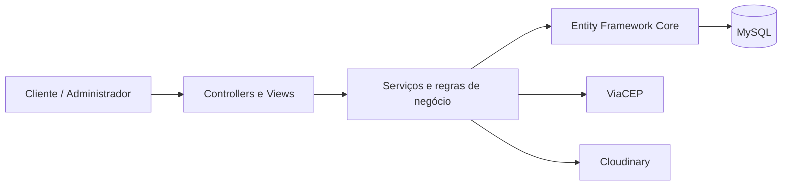

<div align="center">

# Kiora · experiência digital para restaurantes

**Um projeto de TCC que conecta gastronomia, delivery e gestão.**

`C#` · `ASP.NET Core MVC` · `.NET 10` · `MySQL` · `Entity Framework Core`

[**Explorar o site ↗**](https://kiorarestaurante.onrender.com) · [Portfólio Jujuba’s Dev](https://ghostriley115.github.io/Jujubas-LandindPage/)

</div>

## A ideia

O Kiora é um restaurante fictício criado para um Trabalho de Conclusão de Curso em Desenvolvimento de Sistemas. A proposta é construir uma experiência que começa no cardápio online e evolui para a operação do restaurante, aproximando clientes e funcionários por meio da tecnologia.

Este repositório reúne o **sistema web de delivery**, com navegação pelo cardápio, carrinho, pedidos e área administrativa. O aplicativo mobile faz parte da visão de evolução do projeto e **ainda não está implementado neste repositório**.

## Da escolha ao pedido

| Para quem pede | Para quem administra |
| :--- | :--- |
| Cardápio com categorias e produtos | Cadastro e edição de produtos |
| Carrinho com inclusão, alteração e remoção de itens | Controle de disponibilidade e ativação de produtos |
| Cadastro, login e edição de perfil | Painel e consulta de pedidos |
| Endereços de entrega e consulta de CEP | Consulta de usuários e alteração de situação |
| Checkout, detalhes e histórico de pedidos | Acesso restrito ao perfil de administrador |

A implementação também inclui carrinho associado a cookies, mesclagem de carrinho, limpeza de carrinhos e integração com Cloudinary para imagens de produtos. O registro de formas e estados de pagamento faz parte do domínio; isso **não representa uma integração com um gateway de pagamentos**.

## Identidade do restaurante

<table>
<tr>
<td width="50%"></td>
<td width="50%"></td>
</tr>
</table>

*Materiais ilustrativos da identidade do restaurante. Não são capturas da interface do sistema.*

## Como o sistema está organizado



| Camada | Responsabilidade |
| :--- | :--- |
| `Controllers` e `Views` | Fluxos HTTP e interface MVC |
| `Services` e interfaces | Operações e regras da aplicação |
| `Models`, DTOs e ViewModels | Entidades e contratos de dados |
| `Migrations` | Evolução do esquema do banco |
| `wwwroot` | Estilos, scripts e identidade visual |

A autenticação usa cookies e autorização por perfil. O projeto utiliza proteção antifalsificação nas operações configuradas e integração de consulta de endereços com ViaCEP.

## Visão de evolução

O objetivo futuro é conectar o delivery à experiência presencial do restaurante.

| Etapa | Situação neste repositório |
| :--- | :--- |
| Sistema web de delivery e área administrativa | Implementado, em evolução |
| Aplicativo mobile para a equipe | Planejado · não implementado |
| Reservas pelo aplicativo | Planejado · não implementado |
| Criação de pedidos no atendimento presencial | Planejado · não implementado |
| Gerenciamento de mesas pelos funcionários | Planejado · não implementado |
| Integração entre operação mobile e sistema web | Planejada · arquitetura a definir |

As funcionalidades planejadas descrevem a direção do TCC, sem representar recursos já disponíveis ou um cronograma de entrega.

## Executar localmente

**Pré-requisitos:** SDK .NET 10, instância MySQL acessível e credenciais próprias do Cloudinary para os fluxos de upload de imagens.

```bash
git clone https://github.com/GhostRiley115/KioraRestaurante.git
cd KioraRestaurante/KioraRestaurante
dotnet restore
dotnet user-secrets set "ConnectionStrings:ConexaoNuvem" "Server=localhost;Database=kiora;User=SEU_USUARIO;Password=SUA_SENHA;"
dotnet user-secrets set "Cloudinary:CloudName" "SEU_CLOUD_NAME"
dotnet user-secrets set "Cloudinary:ApiKey" "SUA_API_KEY"
dotnet user-secrets set "Cloudinary:ApiSecret" "SEU_API_SECRET"
```

Com a ferramenta `dotnet-ef` da série 9 instalada, aplique as migrations e inicie o projeto em desenvolvimento:

```bash
dotnet ef database update -- --environment Development
dotnet run -- --environment Development
```

Abra o endereço exibido no terminal. A conexão MySQL precisa funcionar já na inicialização, pois a aplicação detecta a versão do servidor. A configuração `Entrega:MunicipiosIbge` define os municípios atendidos e deve corresponder ao cenário de teste. Use dados fictícios para explorar os fluxos.

## Contexto

Projeto acadêmico apresentado no ecossistema **Jujuba’s Dev**. Kiora é uma marca fictícia; sua presença visual foi criada para dar contexto à solução de software.

[**Conheça os outros projetos de Clayton Brito →**](https://github.com/GhostRiley115)
